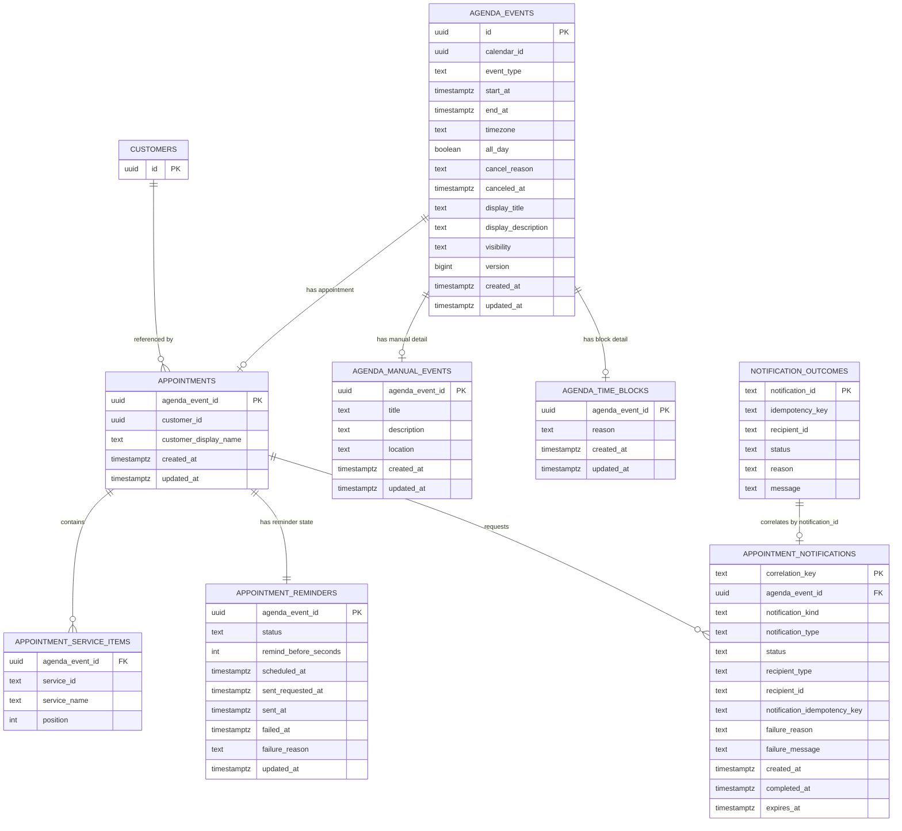
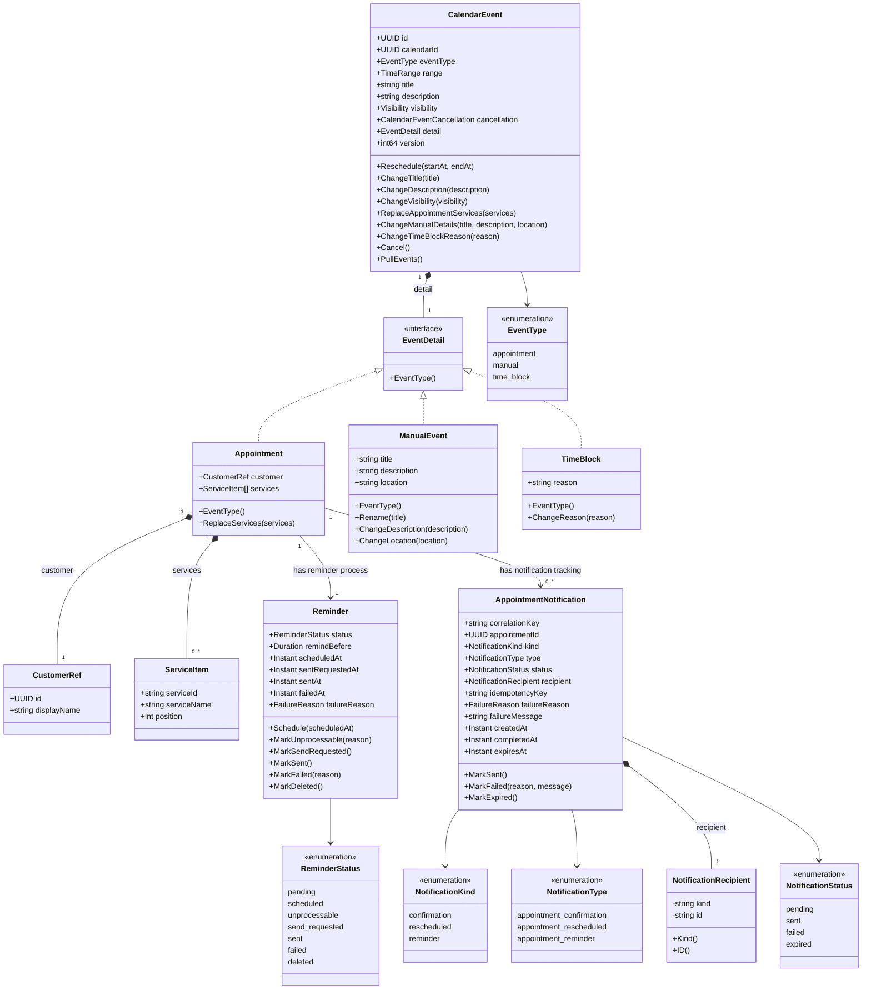

# Appointment redesign

## Problema attuale

Il servizio `appointment` oggi mescola nello stesso aggregate e nella stessa tabella concetti diversi:

- evento calendario
- appuntamento con cliente
- snapshot cliente
- servizi richiesti
- stato reminder
- pending notification
- effetti asincroni verso notification

Questo rende poco chiare le relazioni tra:

- evento
- customer
- reminder
- notification request
- notification outcome

Il risultato e' che alcune decisioni finiscono nel posto sbagliato. Esempi:

- `AgendaEvent` contiene `Attendee`, ma per un appointment l'attendee e' in realta' un customer reference.
- `agenda_events` salva `attendee_id` e `attendee_display_name`, ma non distingue bene tra evento generico e appointment.
- `agenda_events.title` e `agenda_events.description` sembrano campi business, ma per un appointment titolo e descrizione dovrebbero essere derivati dal dettaglio appointment o usati solo come display snapshot.
- `pending_notifications` lega una notification a `agenda_event_id`, ma non rappresenta quale ruolo applicativo ha quella notifica.
- `ReminderStatus` sta dentro `agenda_events`, quindi ogni evento sembra avere un reminder anche quando il reminder e' un processo separato.
- i servizi dell'appuntamento sono JSONB dentro `agenda_events`.

## Obiettivo

Separare i concetti mantenendo un modello semplice:

- `agenda_events`: calendario puro.
- `appointments`: estensione business per eventi di tipo appointment.
- tabelle detail 1:1 per gli altri tipi evento futuri.
- `appointment_services`: catalogo servizi.
- `appointment_service_items`: servizi scelti per un appointment.
- `appointment_reminders`: stato scheduling/invio reminder.
- `appointment_notifications`: richieste notification correlate all'appointment/evento.

`appointment` deve essere owner della relazione tra evento e customer, e della correlazione tra appointment e notification request.

`notification` resta owner della delivery e produce outcome.

Decisione di dominio: `CalendarEvent` e' l'unico aggregate root del calendario. Non esiste un evento calendario senza detail.

I detail iniziali sono:

- `Appointment`
- `ManualEvent`
- `TimeBlock`

La creazione/modifica applicativa passa sempre da `CalendarEvent`. La tabella `agenda_events` resta una base relazionale comune, mentre le tabelle detail sono un dettaglio di persistenza normalizzata.

## Modello proposto

### Pattern eventi tipizzati

Il modello usa una tabella base comune e tabelle detail 1:1.

```text
agenda_events
  id
  event_type
  start_at/end_at
  cancellation/title/description/visibility

appointments
  agenda_event_id
  customer/services/reminder policy

agenda_manual_events
  agenda_event_id
  title/description/location

agenda_time_blocks
  agenda_event_id
  reason
```

Questa e' la traduzione relazionale del pattern esposto da API come Google Calendar: un evento ha un `eventType`, mentre i dati specifici del tipo stanno in blocchi dedicati. In un database relazionale quei blocchi diventano tabelle 1:1 invece di JSON annidato.

Regola:

```text
agenda_events.event_type decide quale detail table deve esistere
```

La tabella base resta stabile quando aggiungiamo nuovi tipi. Per un nuovo tipo si aggiunge:

- nuovo valore `event_type`
- nuova tabella detail se servono dati specifici
- factory/handler dominio
- estensione della read query calendario

### agenda_events

Rappresenta lo slot calendario comune a tutti i tipi evento.

Il servizio gestisce attualmente un solo calendario tecnico, senza modellare una distinta entita' `Calendar`. Tutti gli eventi usano la costante:

```text
d2a36e25-4824-4167-a062-a5af96f97703
```

Le API possono omettere `calendarId`; il backend applica e restituisce sempre questa costante. Un valore diverso viene rifiutato finche' non verra' introdotto un requisito reale multi-calendario.

Campi:

```sql
id UUID PRIMARY KEY
calendar_id UUID NOT NULL
event_type TEXT NOT NULL
start_at TIMESTAMPTZ NOT NULL
end_at TIMESTAMPTZ NOT NULL
timezone TEXT NOT NULL
all_day BOOLEAN NOT NULL DEFAULT false
cancel_reason TEXT NULL
canceled_at TIMESTAMPTZ NULL
display_title TEXT NULL
display_description TEXT NULL
visibility TEXT NOT NULL
version BIGINT NOT NULL
created_at TIMESTAMPTZ NOT NULL
updated_at TIMESTAMPTZ NOT NULL
```

`display_title` e `display_description` sono campi di rendering/cache/override. Non devono contenere significato business.

Non contiene:

- customer id
- customer display name
- titolo business appointment
- descrizione business appointment
- reminder status
- servizi JSONB

Tipi iniziali:

```text
appointment
manual
time_block
```

Tipi futuri plausibili:

```text
holiday
closure
working_location
external_sync
```

### appointments

Rappresenta l'appuntamento business associato a un evento calendario.

Relazione:

```text
appointments.agenda_event_id -> agenda_events.id
```

Campi:

```sql
agenda_event_id UUID PRIMARY KEY
customer_id UUID NOT NULL
customer_display_name TEXT NOT NULL
created_at TIMESTAMPTZ NOT NULL
updated_at TIMESTAMPTZ NOT NULL
```

`appointments` non introduce una seconda identity. L'id dell'appointment e' l'id dell'`AgendaEvent` tipizzato come `appointment`.

Nota: `customer_display_name` e' snapshot per UX/storico. La sorgente ufficiale del customer resta `customer`.

Per `event_type = appointment` deve esistere una riga in `appointments`.

### agenda_manual_events

Rappresenta un evento libero creato direttamente in agenda.

Relazione:

```text
agenda_manual_events.agenda_event_id -> agenda_events.id
```

Campi:

```sql
agenda_event_id UUID PRIMARY KEY
title TEXT NOT NULL
description TEXT NULL
location TEXT NULL
created_at TIMESTAMPTZ NOT NULL
updated_at TIMESTAMPTZ NOT NULL
```

Per `event_type = manual` deve esistere una riga in `agenda_manual_events`.

### agenda_time_blocks

Rappresenta un blocco disponibilita'/indisponibilita' senza customer.

Relazione:

```text
agenda_time_blocks.agenda_event_id -> agenda_events.id
```

Campi:

```sql
agenda_event_id UUID PRIMARY KEY
reason TEXT NOT NULL
created_at TIMESTAMPTZ NOT NULL
updated_at TIMESTAMPTZ NOT NULL
```

Per `event_type = time_block` deve esistere una riga in `agenda_time_blocks`.

### appointment_service_items

Relazione tra appointment e servizi scelti.

```sql
agenda_event_id UUID NOT NULL
service_id TEXT NULL
service_name TEXT NOT NULL
position INTEGER NOT NULL
```

Perche' sia `service_id` che `service_name`:

- `service_id` collega al catalogo quando disponibile.
- `service_name` conserva snapshot storico.

Questo rimuove `services JSONB` da `agenda_events`.

### appointment_reminders

Rappresenta lo stato del processo reminder per un appointment.

```sql
agenda_event_id UUID PRIMARY KEY
status TEXT NOT NULL
remind_before_seconds INTEGER NOT NULL
scheduled_at TIMESTAMPTZ NULL
sent_requested_at TIMESTAMPTZ NULL
sent_at TIMESTAMPTZ NULL
failed_at TIMESTAMPTZ NULL
failure_reason TEXT NULL
updated_at TIMESTAMPTZ NOT NULL
```

Stati:

```text
pending
scheduled
unprocessable
send_requested
sent
failed
deleted
```

River non viene salvato qui. Il job continua a essere identificato da una key logica:

```text
agenda_event:{agendaEventID}:appointment_reminder
```

Questo rende chiara la differenza:

- `appointment_reminders` = stato applicativo
- River = scheduler tecnico

### appointment_notifications

Rappresenta la correlazione tra appointment e ogni notification request inviata a `notification`.

Non e' una tabella "del reminder". Contiene anche le notifiche immediate di lifecycle:

- conferma creazione appuntamento
- conferma spostamento appuntamento
- reminder prima dell'appuntamento

```sql
correlation_key TEXT PRIMARY KEY
agenda_event_id UUID NOT NULL
notification_kind TEXT NOT NULL
notification_type TEXT NOT NULL
status TEXT NOT NULL
recipient_type TEXT NOT NULL
recipient_id TEXT NOT NULL
notification_idempotency_key TEXT NULL
failure_reason TEXT NULL
failure_message TEXT NULL
created_at TIMESTAMPTZ NOT NULL
completed_at TIMESTAMPTZ NULL
expires_at TIMESTAMPTZ NOT NULL
```

Status:

```text
pending
sent
failed
expired
```

Kind:

```text
confirmation
rescheduled
reminder
```

Recipient type iniziale:

```text
customer
```

Nuovi recipient type vanno introdotti solo quando esiste un caso d'uso reale, aggiungendo una factory dedicata nel dominio.

Non manteniamo un enum pubblico di recipient potenziali.

Storage e dominio sono volutamente separati: lo storage usa stringhe `recipient_type`/`recipient_id`, il dominio espone factory business-specifiche.


`notification_kind` e' il ruolo applicativo dentro appointment.

`notification_type` e' il tipo mandato al servizio notification, per esempio:

```text
appointment_confirmation
appointment_rescheduled
appointment_reminder
```

`correlation_key` corrisponde a `CustomerNotificationOutcome.notificationId`.

`notification_idempotency_key` corrisponde a `CustomerNotificationOutcome.idempotencyKey`, utile per audit quando una request contiene piu' customer.

`recipient_type` e `recipient_id` evitano di legare lo storage al solo customer, ma il dominio non espone un enum generico di destinatari futuri. Oggi le notification appointment sono inviate a un customer, quindi il dominio crea un `NotificationRecipient` tramite `NewCustomerNotificationRecipient(customerID)` e persiste `recipient_type = customer`, `recipient_id = appointments.customer_id`.

La tabella resta comunque `appointment_notifications`, non `agenda_notifications`: per ora solo appointment possiede notification e reminder.

## Relazioni

```text
agenda_events 1 -- 0..1 appointments
agenda_events 1 -- 0..1 agenda_manual_events
agenda_events 1 -- 0..1 agenda_time_blocks
appointments 1 -- n appointment_service_items
appointments 1 -- 1 appointment_reminders
appointments 1 -- n appointment_notifications
customer     1 -- n appointments       (reference esterna, non FK locale)
notification 1 -- n appointment_notifications (correlation esterna)
```

Per eventuali tipi futuri senza dati specifici:

```text
agenda_events only
```

Per eventi manual:

```text
agenda_events + agenda_manual_events
```

Per blocchi:

```text
agenda_events + agenda_time_blocks
```

Per appuntamenti:

```text
agenda_events + appointments + appointment_reminders + service items
```

## ER model



Note ER:

- `CUSTOMERS` e `NOTIFICATION_OUTCOMES` sono entita' esterne: non implicano FK locali nel database `appointment`.
- `NOTIFICATION_OUTCOMES.notification_id` corrisponde a `APPOINTMENT_NOTIFICATIONS.correlation_key`.
- `AGENDA_EVENTS.event_type` decide quale detail table 1:1 e' valida.
- `APPOINTMENT_REMINDERS.agenda_event_id` resta `PRIMARY KEY`: un appointment calendar event ha un solo stato reminder corrente.
- `APPOINTMENT_NOTIFICATIONS` ha piu' righe per appointment: confirmation, rescheduled e reminder sono richieste diverse.

## Domain class model

Il modello DDD target viene introdotto in parallelo nel package:

```text
appointment/internal/domain/v2
```

Il vecchio `appointment/internal/domain.AgendaEvent` resta temporaneamente come adapter per HTTP legacy, scheduler e consumer esistenti. Non deve guidare nuove feature.



Regole del modello dominio:

- `CalendarEvent` e' l'aggregate root unico del calendario.
- `ManualEvent`, `TimeBlock` e `Appointment` sono detail domain model mutuamente esclusivi per uno stesso `CalendarEvent`.
- `CalendarEvent` crea insieme campi comuni e detail tramite factory tipizzate, applica reschedule/cancel/update ed emette lifecycle events generali (`CalendarEventCreated`, `CalendarEventRescheduled`, `CalendarEventCanceled`).
- I lifecycle events non sono specifici del subtype. Chi li consuma carica l'agenda event, legge `event_type` e applica solo la logica rilevante per quel tipo.
- `Appointment` coordina solo customer reference e servizi selezionati.
- `AppointmentReminder` resta appointment-only.
- `AppointmentNotification` resta appointment-only. Il destinatario e' un value object opaco: oggi si costruisce solo come customer recipient; nuovi recipient type devono entrare con factory dedicate e regole esplicite, non tramite enum preventivo.
- `AppointmentNotification` non decide effetti business diversi dal proprio stato.
- `Reminder` cambia stato solo per scheduling, reminder due e outcome di una notification con `kind = reminder`.
- Le notifiche `confirmation` e `rescheduled` sono tracciate in `AppointmentNotification`, ma non modificano `Reminder`.

## Polymorphic integrity

Non usiamo una relazione polimorfica del tipo:

```text
agenda_events.detail_type + agenda_events.detail_id
```

perche' perderebbe FK reali e renderebbe piu' debole l'integrita' referenziale.

Usiamo invece:

```text
agenda_events.id <- appointments.agenda_event_id
agenda_events.id <- agenda_manual_events.agenda_event_id
agenda_events.id <- agenda_time_blocks.agenda_event_id
```

Invariant applicative:

- se `agenda_events.event_type = appointment`, deve esistere esattamente una riga in `appointments`
- se `agenda_events.event_type = manual`, deve esistere esattamente una riga in `agenda_manual_events`
- se `agenda_events.event_type = time_block`, deve esistere esattamente una riga in `agenda_time_blocks`
- per uno stesso `agenda_event_id` puo' esistere una sola detail table valorizzata

Queste invariant vanno garantite nella stessa transazione di create/update. Possiamo aggiungere query di consistenza e test di repository per intercettare dati corrotti.

## API contracts

I nuovi contratti API target sono definiti in:

```text
core-contracts/appointment/proto/beaesthetic/appointment/v1/appointment_api.proto
```

Il contratto espone:

- `CalendarService`: create/list/get/reschedule/cancel typed calendar events.
- `ServiceCatalogService`: create/update/search/list servizi appointment.
- `AppointmentInsightService`: ranking e overview.

`AgendaEvent` usa lo stesso pattern del modello dati:

```text
event_type comune
oneof detail:
  appointment
  manual_event
  time_block
```

Questo evita di modellare un endpoint generico con payload JSON non tipizzato. Ogni nuovo tipo evento futuro richiede un nuovo dettaglio nel `oneof` e la relativa tabella detail.

Scelte di pulizia rispetto alle HTTP API legacy:

- niente endpoint unico `CreateAgendaActivity` con discriminator ambiguo
- create command separati: `CreateAppointment`, `CreateManualEvent`, `CreateTimeBlock`
- read model unico: `AgendaEvent` con `event_type` e `oneof detail`
- selezione servizi esplicita: `catalog_service_id` oppure `custom_service_name`
- resend reminder usa `agenda_event_id`, non dettagli interni River
- update catalog usa `FieldMask` per distinguere campi assenti da campi da svuotare

## Aggregate boundary

### Agenda event

Responsabile di:

- event type
- status
- start/end
- timezone/all day
- display title/description opzionali
- cancellazione slot

### Manual event

Responsabile di:

- titolo business dell'evento libero
- descrizione business dell'evento libero
- location libera

### Time block

Responsabile di:

- reason del blocco

### Appointment

Responsabile di:

- customer reference
- snapshot customer display name
- servizi selezionati

### Appointment reminder

Responsabile di:

- reminder policy
- stato reminder
- scheduled/sent/failed timestamps
- failure reason applicativa

### Appointment notification

Responsabile di:

- intenti notification legati al lifecycle appointment
- correlation con notification service
- recipient della notification
- stato outcome notification
- reason/message outcome
- separazione tra ruolo applicativo (`notification_kind`) e template/event type esterno (`notification_type`)

## Notification intent

Appointment produce tre intenti di notifica distinti.

### Confirmation

Quando:

```text
appointment created
```

Effetto:

- pubblica `CustomerNotificationRequested`
- crea `appointment_notifications` con `notification_kind = confirmation` e `recipient_type = customer`
- outcome aggiorna solo `appointment_notifications`
- non modifica `appointment_reminders`

Tipo notification:

```text
appointment_confirmation
```

### Rescheduled

Quando:

```text
appointment start/end changed
```

Effetto:

- pubblica `CustomerNotificationRequested`
- crea `appointment_notifications` con `notification_kind = rescheduled` e `recipient_type = customer`
- outcome aggiorna solo `appointment_notifications`
- non modifica `appointment_reminders`

Tipo notification:

```text
appointment_rescheduled
```

### Reminder

Quando:

```text
River reminder job is due
```

Effetto:

- pubblica `CustomerNotificationRequested`
- crea `appointment_notifications` con `notification_kind = reminder` e `recipient_type = customer`
- outcome aggiorna `appointment_notifications`
- outcome aggiorna anche `appointment_reminders`

Tipo notification:

```text
appointment_reminder
```

Quindi la regola e':

```text
notification outcome always closes appointment_notifications
only reminder outcome changes appointment_reminders
```

## Flusso create appointment target

1. HTTP riceve create appointment.
2. Application risolve il customer tramite `CustomerResolver`.
3. `CustomerResolver` restituisce il `CustomerRef` usato dal dominio, incluso lo snapshot `customer_display_name`.
4. Transazione:
   - crea `agenda_events` con `event_type = appointment`
   - crea `appointments`
   - crea `appointment_service_items`
   - registra su outbox il lifecycle event interno `CalendarEventCreated`
5. Lifecycle consumer riceve `CalendarEventCreated`.
6. Transazione:
   - crea `appointment_reminders` in `pending`
   - calcola reminder
   - inserisce/cancella River job con key `agenda_event:{agendaEventID}:appointment_reminder`
   - aggiorna `appointment_reminders` a `scheduled` o `unprocessable`
   - pubblica notification request `appointment_confirmation`
   - crea `appointment_notifications` pending con `notification_kind = confirmation` e `recipient_type = customer`

## Flusso reschedule target

1. HTTP aggiorna start/end.
2. Transazione:
   - aggiorna `agenda_events.start_at/end_at`
   - registra su outbox `CalendarEventRescheduled`
3. Lifecycle:
   - cancella job River precedente
   - crea nuovo job River
   - aggiorna `appointment_reminders`
   - pubblica notification request `appointment_rescheduled`
   - crea `appointment_notifications` pending con `notification_kind = rescheduled` e `recipient_type = customer`

## Flusso cancel target

1. HTTP cancella appointment/event.
2. Transazione:
   - aggiorna `agenda_events.status` e `agenda_events.cancel_reason`
   - pubblica `AppointmentCanceled`
3. Lifecycle:
   - cancella job River
   - aggiorna `appointment_reminders` a `deleted`
   - opzionale: pubblica notification cancellation se serve

## Flusso reminder due target

1. River esegue `appointment.send_reminder`.
2. Worker carica appointment + agenda event + reminder.
3. Verifica:
   - appointment non cancellato
   - reminder status `scheduled`
   - `expectedStartAt == agenda_events.start_at`
4. Pubblica notification request `appointment_reminder`.
5. Crea `appointment_notifications` pending con `notification_kind = reminder` e `recipient_type = customer`.
6. Aggiorna `appointment_reminders` a `send_requested`.

## Flusso notification outcome target

1. Appointment consuma `CustomerNotificationOutcome`.
2. Cerca `appointment_notifications` via `notificationId`.
3. Se non trova, ack e log.
4. Se status `SENT`:
   - marca notification `sent`
   - se `notification_kind = reminder`, marca reminder `sent`
5. Se status `FAILED`:
   - marca notification `failed`
   - salva `failure_reason` e `failure_message`
   - se `notification_kind = reminder`, marca reminder `failed`

Il consumer decide se chiamare:

- `MarkNotificationSent`
- `MarkNotificationFailed`

Non serve un generico `HandleNotificationOutcome`.

## Cosa resta nel servizio customer

`appointment` salva solo:

- `customer_id`
- `customer_display_name` snapshot

Non replica:

- phone
- email
- preferenze di contatto
- opt-in

Questi rimangono responsabilita' di `notification/customer`.

## Migration incrementale

### Step 1: nuove tabelle, senza switch

Creare:

- `appointments`
- `agenda_manual_events`
- `agenda_time_blocks`
- `appointment_service_items`
- `appointment_reminders`
- `appointment_notifications`

Nessun cambio comportamento.

### Step 2: dual write temporaneo pre-cutover

Su create/update/delete:

- continuare a scrivere `agenda_events` legacy
- iniziare a scrivere le nuove tabelle

Questo serve solo durante la finestra di transizione mentre il vecchio codice e il nuovo modello convivono.

### Step 3: backfill manuale

Eseguire il comando operativo:

```bash
appointment backfill-agenda-model --env-file .env.local
```

Senza flag aggiuntivi il comando fa dry-run e stampa i conteggi.

Per applicare:

```bash
appointment backfill-agenda-model --env-file .env.local --execute
```

Il comando migra:

- `agenda_events[event_type=appointment]` -> `appointments`
- `agenda_events[event_type=event]` -> `agenda_manual_events`
- `agenda_events.services` -> `appointment_service_items`
- stato reminder legacy -> `appointment_reminders`
- `pending_notifications` -> `appointment_notifications`

Gli appointment legacy con `attendee_id` non UUID vengono saltati e contati come `skipped_invalid_customers`.

### Step 4: cutover diretto al nuovo modello

Spostare read/query e write principali sulle nuove tabelle. Non prevedere fallback runtime sul legacy.

### Step 5: reminder switch

Spostare reminder state da `agenda_events` a `appointment_reminders`.

### Step 6: notification switch

Spostare pending notification da `pending_notifications` a `appointment_notifications`.

### Step 7: cleanup

Rimuovere da `agenda_events`:

- `title`
- `description`
- `attendee_id`
- `attendee_display_name`
- `services`
- `reminder_status`
- `reminder_sent_at`
- `remind_before_seconds`

Rimuovere tabella legacy:

- `pending_notifications`

## Decisioni aperte

1. `appointments.id` deve essere uguale a `agenda_events.id` oppure separato?
   - Consiglio: separato, ma `agenda_event_id UNIQUE`.
2. Gli eventi generici devono avere reminder?
   - Consiglio: no, almeno nel primo redesign.
3. Le confirmation/rescheduled notification devono aggiornare qualche stato business?
   - Consiglio: solo `appointment_notifications`, non `appointment_reminders`.
4. Serve storico notification multiplo per stesso tipo?
   - Consiglio: si', una riga per correlation key.
5. I servizi appuntamento devono mantenere prezzo snapshot?
   - Consiglio: si', evita drift storico quando cambia catalogo.
6. `display_title` e `display_description` vanno sempre salvati o calcolati on read?
   - Consiglio: salvarli come snapshot/override per performance e UX, ma non usarli come sorgente business.
